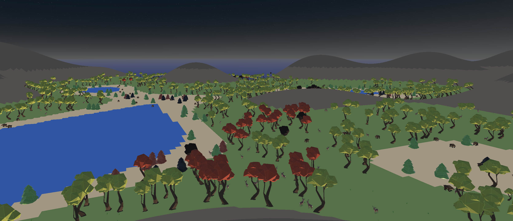
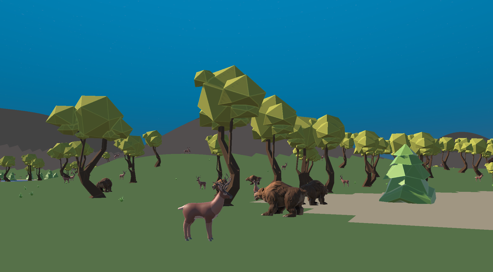
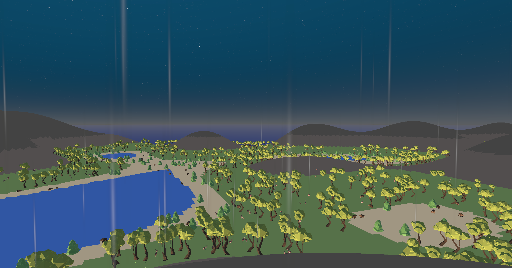

# Description
Ekaterina SEDELNIKOVA : responsable environnement 
Cyrielle GEDOR : responsable agents

Simulation environnementale avec la météo, les feux de forêt et des agents virtuels sur Unity en 3D.

# Images
Le Monde: 

 Le Feu: 

 Les Animaux: 

 La Pluie: 

 Le Cycle Jour-Nuit: 

